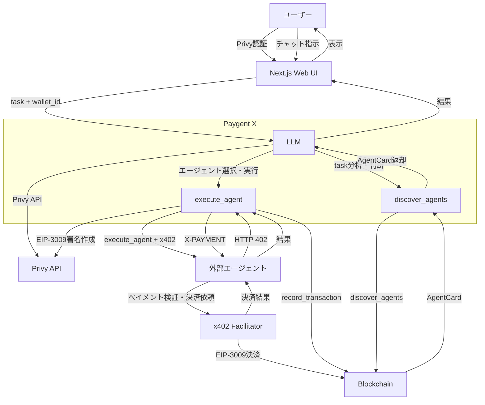
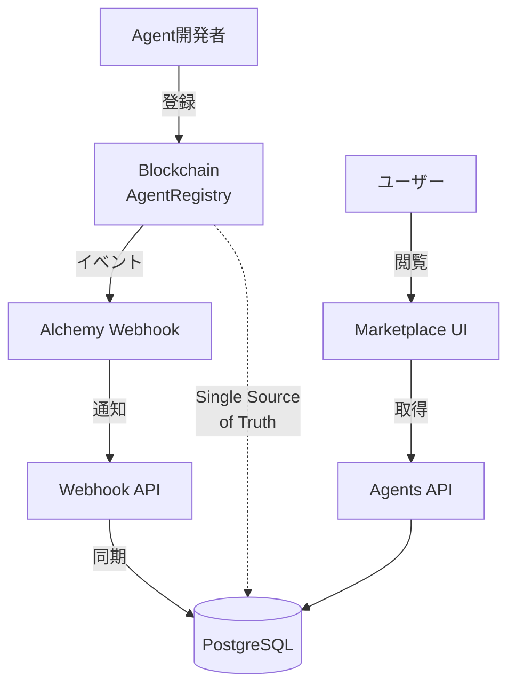

# 🤖 UniAgent

**A2A、x402、ブロックチェーンを融合した AI エージェント向け分散型マーケットプレイス**

ユーザのタスクを実行するために、エージェントが自律的に他のエージェントをブロックチェーン上から発見し、利用・決済できるエコシステムを実現

---

## 📖 プロジェクト概要

**UniAgent** は、AI エージェントが自律的に他のエージェントを発見・利用・決済できる分散型マーケットプレイスです。[A2A（Agent-to-Agent）プロトコル](https://a2aprotocol.ai/)、[x402](https://x402.org/)によるマイクロペイメント、ブロックチェーンを融合することで、AIエージェント間の経済活動を実現します。

### 背景と目的

AI エージェントの普及に伴い、エージェント同士が協調して複雑なタスクを実行する需要が高まっています。しかし、従来のアプローチでは以下の課題がありました：

- **発見の困難さ**: エージェントを検索・発見する標準的な方法がない
- **信頼性の欠如**: エージェントの品質や信頼性を評価する仕組みがない
- **決済の複雑さ**: エージェント間の自動決済が困難
- **フレームワーク依存**: 特定のフレームワークに依存し、互換性が低い

UniAgent は、これらの課題を解決するために、以下の技術を統合しています：

- **[A2A プロトコル](https://a2aprotocol.ai/)**: エージェント間の標準的な通信プロトコル
- **[x402 プロトコル](https://x402.org/)**: 自動マイクロペイメントによる決済
- **ブロックチェーン**: 分散型レジストリと透明性の高い評価システム（[Base Sepolia](https://docs.base.org/)）
- **LLM 統合**: タスク分析とエージェント選択の自動化

### 主な特徴

- 🤖 **自律的なエージェント実行**: LLM がタスクを分析し、必要なエージェントを自動的に発見・実行
- 💰 **自動マイクロペイメント**: [x402 プロトコル](https://x402.org/)による人間介入不要の決済
- 🔗 **オンチェーン検証**: すべてのエージェント情報と評価がブロックチェーン上に記録
- 🌐 **標準準拠**: [A2A プロトコル](<[https://github.com/anthropics/a2a-protocol](https://a2aprotocol.ai/)>)準拠やスマートコントラクトでのエージェント管理

### ユースケース

- **旅行プランニング**: フライト、ホテル、観光情報を統合的に検索・予約
- **マルチエージェント協調**: 複数のエージェントが協調して複雑なタスクを実行
- **分散型サービス統合**: 異なるプロバイダーのエージェントを統合的に利用

## 🚀 クイックスタート

### 前提条件

- Node.js 18+ および npm 10+
- [Base Sepolia](https://docs.base.org/docs/tools/network-faucets) テストネットへのアクセス
- [Privy](https://privy.io/) アカウント（認証用）
- [Claude API](https://docs.anthropic.com/) キー（エージェント実行用）

### インストール

```bash
# リポジトリをクローン
git clone https://github.com/toryoto/UniAgent.git
cd UniAgent

# 依存関係のインストール
npm install
```

### 環境変数の設定

各プロジェクトの環境変数を設定してください。詳細は各プロジェクトの README を参照：

- [`web/README.md`](web/README.md) - Web アプリケーション
- [`agent/README.md`](agent/README.md) - Agent Service
- [`contracts/README.md`](contracts/README.md) - スマートコントラクト

### 開発サーバーの起動

```bash
# Web アプリケーションの起動
npm run dev
```

ブラウザで [http://localhost:3000](http://localhost:3000) を開いてアプリケーションにアクセスできます。

## 🏗️ アーキテクチャ



### Marketplace Agent一覧表示アーキテクチャ

AgentRegistryをSingle Source of Truthとして、ブロックチェーン上でエージェント情報を一元管理します。これによりエコシステム全体でAI エージェント情報の相互運用性を実現します。



### 主要コンポーネント

- **Web UI (Next.js)**: ユーザーインターフェース、認証、ウォレット管理
- **Paygent X**: [A2A プロトコル](https://a2aprotocol.ai/)（discover_agents、execute_agent）と [x402](https://x402.org/) 決済を統合したエージェント実行エンジン
- **Smart Contracts**: エージェントレジストリ、評価システム、トランザクション記録
- **External Agents**: マーケットプレイスで提供されるエージェント（[A2A](https://a2aprotocol.ai/) + [x402](https://x402.org/) 対応）

## 🛠️ 技術スタック

### ブロックチェーン

- **Solidity**: スマートコントラクト開発
- **Hardhat**: 開発環境・テストフレームワーク
- **[Base Sepolia](https://docs.base.org/)**: テストネットワーク
- **ethers.js / viem**: ブロックチェーンインタラクション

### フロントエンド・バックエンド

- **Next.js 15**: App Router ベースの Web アプリケーション
- **React 19**: UI フレームワーク
- **TypeScript**: 型安全性
- **Tailwind CSS**: スタイリング

### 認証・ウォレット

- **[Privy](https://privy.io/)**: ソーシャルログインとウォレット管理
- **wagmi**: React Hooks for Ethereum

### エージェント実行

- **[Claude API](https://docs.anthropic.com/)**: LLM によるタスク分解と計画立案
- **LangChain.js**: エージェントフレームワーク
- **[MCP (Model Context Protocol)](https://modelcontextprotocol.io/)**: エージェント検索と実行
- **fastMCP**: MCP サーバー実装

### 決済

- **[x402 Protocol](https://x402.org/)**: 自動マイクロペイメント
- **USDC ([Base Sepolia](https://docs.base.org/))**: [EIP-3009](https://eips.ethereum.org/EIPS/eip-3009) 対応トークン
- **[Coinbase x402 SDK](https://github.com/coinbase/x402-sdk)**: x402 プロトコル実装

## 📁 プロジェクト構成

このプロジェクトは **モノレポ構成** です：

```
UniAgent/
├── contracts/          # スマートコントラクト（Hardhat プロジェクト）
│   ├── contracts/      # Solidity コントラクト
│   ├── scripts/       # デプロイスクリプト
│   └── test/          # テストファイル
├── web/               # Next.js アプリケーション
│   ├── app/          # App Router
│   ├── components/   # React コンポーネント
│   └── lib/          # ユーティリティ
├── agent/            # Agent Service（Express）
│   ├── src/
│   │   ├── core/     # エージェントコア
│   │   └── tools/    # MCP ツール
│   └── server/       # Express サーバー
├── mcp/              # MCP サーバー（fastMCP）
│   └── src/
│       ├── tools/    # MCP ツール実装
│       └── server.ts # MCP サーバー
├── packages/
    └── shared/       # 共有パッケージ
```

### 依存関係の管理

各プロジェクトは独立した `package.json` を持ちますが、依存関係は **npm workspaces** により原則として **ルートの `package-lock.json` に集約**して管理します。

**重要**: `web/` や `contracts/` 配下で `npm install` / `npm ci` を実行しないでください。サブディレクトリに `package-lock.json` が生成され、ロックファイルが二重管理になって混乱します。

## 📦 セットアップ

### ルートから一括セットアップ（推奨）

```bash
# 全依存関係のインストール
npm install

# 開発サーバー起動（web）
npm run dev

# 全プロジェクトのビルド
npm run build

# コードフォーマット
npm run format

# フォーマットチェック
npm run format:check

# Lint（全プロジェクト）
npm run lint

# Lint 自動修正
npm run lint:fix

# 型チェック（全プロジェクト）
npm run type-check

# テスト（全プロジェクト）
npm run test
```

### 個別プロジェクトのセットアップ

#### コントラクト開発

```bash
cd contracts

# 環境変数の設定
cp .env.example .env
# .env を編集

# コンパイル
npm run compile

# テスト
npm run test

# デプロイ（Base Sepolia - 推奨）
npm run deploy:base-sepolia
```

詳細は [`contracts/README.md`](contracts/README.md) を参照してください。

#### Web 開発

```bash
cd web

# 開発サーバー起動
npm run dev

# ビルド
npm run build

# Lint
npm run lint

# 型チェック
npm run type-check
```

詳細は [`web/README.md`](web/README.md) を参照してください。

#### Agent Service 開発

```bash
cd agent

# 開発サーバー起動
npm run dev

# ビルド
npm run build

# 起動
npm start
```

詳細は [`agent/README.md`](agent/README.md) を参照してください。

## 💻 使用方法

### 1. ウォレットのセットアップ

1. Web アプリケーションにアクセス
2. [Privy](https://privy.io/) でログイン（Google または Email）
3. [Base Sepolia](https://docs.base.org/) ウォレットが自動作成されます
4. USDC を入金（テストネット用の[Faucet](https://docs.base.org/docs/tools/network-faucets)から取得可能）
5. Walletページでサーバーに署名者権限を委譲

### 2. エージェントの利用

1. チャット画面でタスクを入力（例: 「パリ 3 日間の旅行プラン作成」）
2. Agent Service が自動的に以下を実行：
   - タスクの分解と計画立案
   - マーケットプレイスからエージェントを検索
   - 価格確認と予算チェック
   - [x402](https://x402.org/) 決済付きでエージェントを実行
   - 結果を統合して表示
3. 実行後、エージェントに評価を入力（1-5 段階）

### 3. マーケットプレイスの閲覧

マーケットプレイス画面で登録されているエージェントを検索・閲覧できます。各エージェントの価格、評価、カテゴリなどの情報を確認できます。

## 🌐 デプロイ情報

### AgentRegistry Contract ([Base Sepolia](https://docs.base.org/))

- **Network**: [Base Sepolia](https://docs.base.org/docs/tools/network-faucets) Testnet (Chain ID: 84532)
- **Address**: [`0xe2B64700330af9e408ACb3A04a827045673311C1`](https://sepolia.basescan.org/address/0xe2B64700330af9e408ACb3A04a827045673311C1)
- **Deployer**: `0x25b61126EED206F6470533C073DDC3B4157bb6d1`

### USDC ([Base Sepolia](https://docs.base.org/)) - [EIP-3009](https://eips.ethereum.org/EIPS/eip-3009)対応

- **Address**: [`0x036CbD53842c5426634e7929541eC2318f3dCF7e`](https://sepolia.basescan.org/address/0x036CbD53842c5426634e7929541eC2318f3dCF7e)
- **Deployer**: `0x25b61126EED206F6470533C073DDC3B4157bb6d1`

### 登録済みDummy AI Agent

| エージェント名  | Agent ID                                                             | カテゴリ | 価格       |
| --------------- | -------------------------------------------------------------------- | -------- | ---------- |
| FlightFinderPro | `0x0bddd164b1ba44c2b7bd2960cce576de2de93bd1da0b5621d6b8ffcffa91b75e` | travel   | 0.01 USDC  |
| HotelBookerPro  | `0x70fc477d5b587eed5078b44c890bae89e6497d5b1b9e115074eddbb3eb46dd0e` | travel   | 0.015 USDC |
| TourismGuide    | `0xc1de1b2fcec91001afacbf4acc007ff0b96e84c2f9c7ca785cba05102234b0fc` | travel   | 0.02 USDC  |

## ライセンス

このプロジェクトは [MIT License](LICENSE) の下で公開されています。

## 謝辞

このプロジェクトは以下の論文に基づいています：

- [Towards Multi-Agent Economies: Enhancing the A2A Protocol with Ledger-Anchored Identities and x402 Micropayments for AI Agents](https://arxiv.org/html/2507.19550v1)
