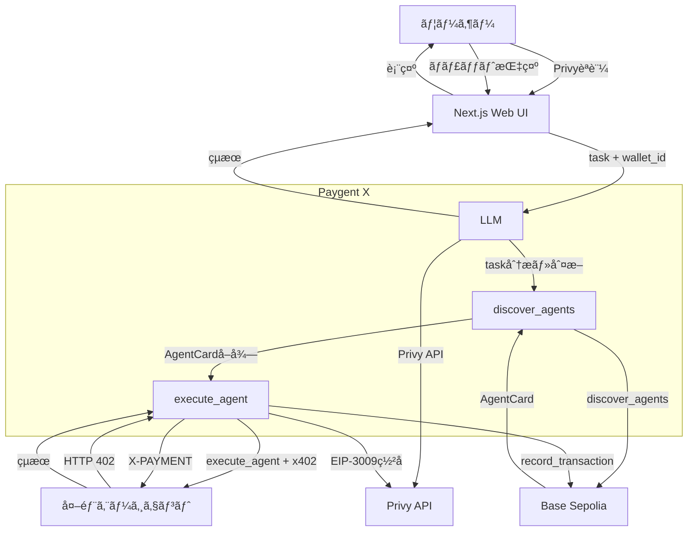

# 🤖 UniAgent

**A2Aã€x402ã€ãƒ–ロックãƒã‚§ãƒ¼ãƒ³ã‚’èåˆã—㟠AI Agentå‘ã‘分散å‹ãƒãƒ¼ã‚±ãƒƒãƒˆãƒ—レイス**

エージェントãŒè‡ªå¾‹çš„ã«ä»–ã®ã‚¨ãƒ¼ã‚¸ã‚§ãƒ³ãƒˆã‚’発見・利用・決済ã§ãるエコシステムを実ç¾

---

## 📖 プロジェクト概è¦

**UniAgent** ã¯ã€AI エージェントãŒè‡ªå¾‹çš„ã«ä»–ã®ã‚¨ãƒ¼ã‚¸ã‚§ãƒ³ãƒˆã‚’発見・利用・決済ã§ãる分散å‹ãƒãƒ¼ã‚±ãƒƒãƒˆãƒ—レイスã§ã™ã€‚[A2A（Agent-to-Agent）プロトコル](https://github.com/anthropics/a2a-protocol)ã€[x402](https://x402.org/)ã«ã‚ˆã‚‹ãƒã‚¤ã‚¯ãƒ­ãƒšã‚¤ãƒ¡ãƒ³ãƒˆã€ãƒ–ロックãƒã‚§ãƒ¼ãƒ³ã‚’èåˆã™ã‚‹ã“ã¨ã§ã€AIエージェント間ã®çµŒæ¸ˆæ´»å‹•ã‚’実ç¾ã—ã¾ã™ã€‚

### 背景ã¨ç›®çš„

AI エージェントã®æ™®åŠã«ä¼´ã„ã€ã‚¨ãƒ¼ã‚¸ã‚§ãƒ³ãƒˆåŒå£«ãŒå”調ã—ã¦è¤‡é›‘ãªã‚¿ã‚¹ã‚¯ã‚’実行ã™ã‚‹éœ€è¦ãŒé«˜ã¾ã£ã¦ã„ã¾ã™ã€‚ã—ã‹ã—ã€å¾“æ¥ã®ã‚¢ãƒ—ローãƒã§ã¯ä»¥ä¸‹ã®èª²é¡ŒãŒã‚ã‚Šã¾ã—ãŸï¼š

- **発見ã®å›°é›£ã•**: エージェントを検索・発見ã™ã‚‹æ¨™æº–çš„ãªæ–¹æ³•ãŒãªã„
- **信頼性ã®æ¬ å¦‚**: エージェントã®å“質や信頼性を評価ã™ã‚‹ä»•çµ„ã¿ãŒãªã„
- **決済ã®è¤‡é›‘ã•**: エージェント間ã®è‡ªå‹•æ±ºæ¸ˆãŒå›°é›£
- **フレームワークä¾å­˜**: 特定ã®ãƒ•ãƒ¬ãƒ¼ãƒ ãƒ¯ãƒ¼ã‚¯ã«ä¾å­˜ã—ã€äº’æ›æ€§ãŒä½ã„

UniAgent ã¯ã€ã“れらã®èª²é¡Œã‚’解決ã™ã‚‹ãŸã‚ã«ã€ä»¥ä¸‹ã®æŠ€è¡“ã‚’çµ±åˆã—ã¦ã„ã¾ã™ï¼š

- **[A2A プロトコル](https://github.com/anthropics/a2a-protocol)**: エージェント間ã®æ¨™æº–çš„ãªé€šä¿¡ãƒ—ロトコル
- **[x402 プロトコル](https://x402.org/)**: 自動ãƒã‚¤ã‚¯ãƒ­ãƒšã‚¤ãƒ¡ãƒ³ãƒˆã«ã‚ˆã‚‹æ±ºæ¸ˆ
- **ブロックãƒã‚§ãƒ¼ãƒ³**: 分散å‹ãƒ¬ã‚¸ã‚¹ãƒˆãƒªã¨è©•ä¾¡ã‚·ã‚¹ãƒ†ãƒ ï¼ˆ[Base Sepolia](https://docs.base.org/)）
- **LLM çµ±åˆ**: タスク分æã¨ã‚¨ãƒ¼ã‚¸ã‚§ãƒ³ãƒˆé¸æŠã®è‡ªå‹•åŒ–

### 主ãªç‰¹å¾´

- 🤖 **自律的ãªã‚¨ãƒ¼ã‚¸ã‚§ãƒ³ãƒˆå®Ÿè¡Œ**: LLM ãŒã‚¿ã‚¹ã‚¯ã‚’分æã—ã€å¿…è¦ãªã‚¨ãƒ¼ã‚¸ã‚§ãƒ³ãƒˆã‚’自動的ã«ç™ºè¦‹ãƒ»å®Ÿè¡Œ
- 💰 **自動ãƒã‚¤ã‚¯ãƒ­ãƒšã‚¤ãƒ¡ãƒ³ãƒˆ**: [x402 プロトコル](https://x402.org/)ã«ã‚ˆã‚‹äººé–“介入ä¸è¦ã®æ±ºæ¸ˆ
- 🔗 **オンãƒã‚§ãƒ¼ãƒ³æ¤œè¨¼**: ã™ã¹ã¦ã®ã‚¨ãƒ¼ã‚¸ã‚§ãƒ³ãƒˆæƒ…å ±ã¨è©•ä¾¡ãŒãƒ–ロックãƒã‚§ãƒ¼ãƒ³ä¸Šã«è¨˜éŒ²
- 🌠**標準準拠**: [A2A プロトコル](https://github.com/anthropics/a2a-protocol)準拠やスãƒãƒ¼ãƒˆã‚³ãƒ³ãƒˆãƒ©ã‚¯ãƒˆã§ã®ã‚¨ãƒ¼ã‚¸ã‚§ãƒ³ãƒˆç®¡ç†

### ユースケース

- **旅行プランニング**: フライトã€ãƒ›ãƒ†ãƒ«ã€è¦³å…‰æƒ…報を統åˆçš„ã«æ¤œç´¢ãƒ»äºˆç´„
- **ãƒãƒ«ãƒã‚¨ãƒ¼ã‚¸ã‚§ãƒ³ãƒˆå”調**: 複数ã®ã‚¨ãƒ¼ã‚¸ã‚§ãƒ³ãƒˆãŒå”調ã—ã¦è¤‡é›‘ãªã‚¿ã‚¹ã‚¯ã‚’実行
- **分散å‹ã‚µãƒ¼ãƒ“ス統åˆ**: ç•°ãªã‚‹ãƒ—ロãƒã‚¤ãƒ€ãƒ¼ã®ã‚¨ãƒ¼ã‚¸ã‚§ãƒ³ãƒˆã‚’çµ±åˆçš„ã«åˆ©ç”¨

## 🚀 クイックスタート

### å‰ææ¡ä»¶

- Node.js 18+ ãŠã‚ˆã³ npm 10+
- [Base Sepolia](https://docs.base.org/docs/tools/network-faucets) テストãƒãƒƒãƒˆã¸ã®ã‚¢ã‚¯ã‚»ã‚¹
- [Privy](https://privy.io/) アカウント（èªè¨¼ç”¨ï¼‰
- [Claude API](https://docs.anthropic.com/) キー（エージェント実行用）

### インストール

```bash
# リãƒã‚¸ãƒˆãƒªã‚’クローン
git clone https://github.com/toryoto/UniAgent.git
cd UniAgent

# ä¾å­˜é–¢ä¿‚ã®ã‚¤ãƒ³ã‚¹ãƒˆãƒ¼ãƒ«
npm install
```

### 環境変数ã®è¨­å®š

å„プロジェクトã®ç’°å¢ƒå¤‰æ•°ã‚’設定ã—ã¦ãã ã•ã„。詳細ã¯å„プロジェクト㮠README ã‚’å‚照：

- [`web/README.md`](web/README.md) - Web アプリケーション
- [`agent/README.md`](agent/README.md) - Agent Service
- [`contracts/README.md`](contracts/README.md) - スãƒãƒ¼ãƒˆã‚³ãƒ³ãƒˆãƒ©ã‚¯ãƒˆ

### 開発サーãƒãƒ¼ã®èµ·å‹•

```bash
# Web アプリケーションã®èµ·å‹•
npm run dev
```

ブラウザ㧠[http://localhost:3000](http://localhost:3000) ã‚’é–‹ã„ã¦ã‚¢ãƒ—リケーションã«ã‚¢ã‚¯ã‚»ã‚¹ã§ãã¾ã™ã€‚

## ğŸ—ï¸ ã‚¢ãƒ¼ã‚­ãƒ†ã‚¯ãƒãƒ£


```mermaid
graph TB
    User[ユーザー] -->|Privyèªè¨¼| UI[Next.js Web UI]
    User -->|ãƒãƒ£ãƒƒãƒˆæŒ‡ç¤º| UI

    subgraph PaygentX["Paygent X"]
        LLM[LLM]
        Discover[discover_agents]
        Execute[execute_agent]
        LLM -->|task分æ・判断| Discover
        Discover -->|AgentCardå–å¾—| Execute
    end

    UI -->|task + wallet_id| LLM
    LLM -->|Privy API| Privy[Privy API]
    Discover -->|discover_agents| BC[Base Sepolia]
    BC -->|AgentCard| Discover

    Execute -->|execute_agent + x402| ExtAgent[外部エージェント]
    ExtAgent -->|HTTP 402| Execute
    Execute -->|EIP-3009ç½²å| Privy
    Execute -->|X-PAYMENT| ExtAgent
    ExtAgent -->|çµæœ| Execute

    Execute -->|record_transaction| BC
    LLM -->|çµæœ| UI
    UI -->|表示| User
```

### 主è¦ã‚³ãƒ³ãƒãƒ¼ãƒãƒ³ãƒˆ

- **Web UI (Next.js)**: ユーザーインターフェースã€èªè¨¼ã€ã‚¦ã‚©ãƒ¬ãƒƒãƒˆç®¡ç†
- **Paygent X**: [A2A プロトコル](https://github.com/anthropics/a2a-protocol)（discover_agentsã€execute_agent）㨠[x402](https://x402.org/) 決済を統åˆã—ãŸã‚¨ãƒ¼ã‚¸ã‚§ãƒ³ãƒˆå®Ÿè¡Œã‚¨ãƒ³ã‚¸ãƒ³
- **Smart Contracts**: エージェントレジストリã€è©•ä¾¡ã‚·ã‚¹ãƒ†ãƒ ã€ãƒˆãƒ©ãƒ³ã‚¶ã‚¯ã‚·ãƒ§ãƒ³è¨˜éŒ²
- **External Agents**: ãƒãƒ¼ã‚±ãƒƒãƒˆãƒ—レイスã§æä¾›ã•ã‚Œã‚‹ã‚¨ãƒ¼ã‚¸ã‚§ãƒ³ãƒˆï¼ˆ[A2A](https://github.com/anthropics/a2a-protocol) + [x402](https://x402.org/) 対応）

## ğŸ› ï¸ æŠ€è¡“ã‚¹ã‚¿ãƒƒã‚¯

### ブロックãƒã‚§ãƒ¼ãƒ³

- **Solidity**: スãƒãƒ¼ãƒˆã‚³ãƒ³ãƒˆãƒ©ã‚¯ãƒˆé–‹ç™º
- **Hardhat**: 開発環境・テストフレームワーク
- **[Base Sepolia](https://docs.base.org/)**: テストãƒãƒƒãƒˆãƒ¯ãƒ¼ã‚¯
- **ethers.js / viem**: ブロックãƒã‚§ãƒ¼ãƒ³ã‚¤ãƒ³ã‚¿ãƒ©ã‚¯ã‚·ãƒ§ãƒ³

### フロントエンド・ãƒãƒƒã‚¯ã‚¨ãƒ³ãƒ‰

- **Next.js 15**: App Router ベース㮠Web アプリケーション
- **React 19**: UI フレームワーク
- **TypeScript**: å‹å®‰å…¨æ€§
- **Tailwind CSS**: スタイリング

### èªè¨¼ãƒ»ã‚¦ã‚©ãƒ¬ãƒƒãƒˆ

- **[Privy](https://privy.io/)**: ソーシャルログインã¨ã‚¦ã‚©ãƒ¬ãƒƒãƒˆç®¡ç†
- **wagmi**: React Hooks for Ethereum

### エージェント実行

- **[Claude API](https://docs.anthropic.com/)**: LLM ã«ã‚ˆã‚‹ã‚¿ã‚¹ã‚¯åˆ†è§£ã¨è¨ˆç”»ç«‹æ¡ˆ
- **LangChain.js**: エージェントフレームワーク
- **[MCP (Model Context Protocol)](https://modelcontextprotocol.io/)**: エージェント検索ã¨å®Ÿè¡Œ
- **fastMCP**: MCP サーãƒãƒ¼å®Ÿè£…

### 決済

- **[x402 Protocol](https://x402.org/)**: 自動ãƒã‚¤ã‚¯ãƒ­ãƒšã‚¤ãƒ¡ãƒ³ãƒˆ
- **USDC ([Base Sepolia](https://docs.base.org/))**: [EIP-3009](https://eips.ethereum.org/EIPS/eip-3009) 対応トークン
- **[Coinbase x402 SDK](https://github.com/coinbase/x402-sdk)**: x402 プロトコル実装

## 📠プロジェクト構æˆ

ã“ã®ãƒ—ロジェクト㯠**モãƒãƒ¬ãƒæ§‹æˆ** ã§ã™ï¼š

```
UniAgent/
├── contracts/          # スãƒãƒ¼ãƒˆã‚³ãƒ³ãƒˆãƒ©ã‚¯ãƒˆï¼ˆHardhat プロジェクト）
│   ├── contracts/      # Solidity コントラクト
│   ├── scripts/       # デプロイスクリプト
│   └── test/          # テストファイル
├── web/               # Next.js アプリケーション
│   ├── app/          # App Router
│   ├── components/   # React コンãƒãƒ¼ãƒãƒ³ãƒˆ
│   └── lib/          # ユーティリティ
├── agent/            # Agent Service（Express）
│   ├── src/
│   │   ├── core/     # エージェントコア
│   │   └── tools/    # MCP ツール
│   └── server/       # Express サーãƒãƒ¼
├── mcp/              # MCP サーãƒãƒ¼ï¼ˆfastMCP）
│   └── src/
│       ├── tools/    # MCP ツール実装
│       └── server.ts # MCP サーãƒãƒ¼
├── packages/
    └── shared/       # 共有パッケージ
```

### ä¾å­˜é–¢ä¿‚ã®ç®¡ç†

å„プロジェクトã¯ç‹¬ç«‹ã—㟠`package.json` ã‚’æŒã¡ã¾ã™ãŒã€ä¾å­˜é–¢ä¿‚㯠**npm workspaces** ã«ã‚ˆã‚ŠåŸå‰‡ã¨ã—㦠**ルート㮠`package-lock.json` ã«é›†ç´„**ã—ã¦ç®¡ç†ã—ã¾ã™ã€‚

**é‡è¦**: `web/` ã‚„ `contracts/` é…下㧠`npm install` / `npm ci` を実行ã—ãªã„ã§ãã ã•ã„。サブディレクトリ㫠`package-lock.json` ãŒç”Ÿæˆã•ã‚Œã€ãƒ­ãƒƒã‚¯ãƒ•ã‚¡ã‚¤ãƒ«ãŒäºŒé‡ç®¡ç†ã«ãªã£ã¦æ··ä¹±ã—ã¾ã™ã€‚

## 📦 セットアップ

### ルートã‹ã‚‰ä¸€æ‹¬ã‚»ãƒƒãƒˆã‚¢ãƒƒãƒ—（æ¨å¥¨ï¼‰

```bash
# å…¨ä¾å­˜é–¢ä¿‚ã®ã‚¤ãƒ³ã‚¹ãƒˆãƒ¼ãƒ«
npm install

# 開発サーãƒãƒ¼èµ·å‹•ï¼ˆweb）
npm run dev

# 全プロジェクトã®ãƒ“ルド
npm run build

# コードフォーãƒãƒƒãƒˆ
npm run format

# フォーãƒãƒƒãƒˆãƒã‚§ãƒƒã‚¯
npm run format:check

# Lint（全プロジェクト）
npm run lint

# Lint 自動修正
npm run lint:fix

# å‹ãƒã‚§ãƒƒã‚¯ï¼ˆå…¨ãƒ—ロジェクト）
npm run type-check

# テスト（全プロジェクト）
npm run test
```

### 個別プロジェクトã®ã‚»ãƒƒãƒˆã‚¢ãƒƒãƒ—

#### コントラクト開発

```bash
cd contracts

# 環境変数ã®è¨­å®š
cp .env.example .env
# .env を編集

# コンパイル
npm run compile

# テスト
npm run test

# デプロイ（Base Sepolia - æ¨å¥¨ï¼‰
npm run deploy:base-sepolia
```

詳細㯠[`contracts/README.md`](contracts/README.md) ã‚’å‚ç…§ã—ã¦ãã ã•ã„。

#### Web 開発

```bash
cd web

# 開発サーãƒãƒ¼èµ·å‹•
npm run dev

# ビルド
npm run build

# Lint
npm run lint

# å‹ãƒã‚§ãƒƒã‚¯
npm run type-check
```

詳細㯠[`web/README.md`](web/README.md) ã‚’å‚ç…§ã—ã¦ãã ã•ã„。

#### Agent Service 開発

```bash
cd agent

# 開発サーãƒãƒ¼èµ·å‹•
npm run dev

# ビルド
npm run build

# èµ·å‹•
npm start
```

詳細㯠[`agent/README.md`](agent/README.md) ã‚’å‚ç…§ã—ã¦ãã ã•ã„。

## 💻 使用方法

### 1. ウォレットã®ã‚»ãƒƒãƒˆã‚¢ãƒƒãƒ—

1. Web アプリケーションã«ã‚¢ã‚¯ã‚»ã‚¹
2. [Privy](https://privy.io/) ã§ãƒ­ã‚°ã‚¤ãƒ³ï¼ˆGoogle ã¾ãŸã¯ Email）
3. [Base Sepolia](https://docs.base.org/) ウォレットãŒè‡ªå‹•ä½œæˆã•ã‚Œã¾ã™
4. USDC を入金（テストãƒãƒƒãƒˆç”¨ã®[Faucet](https://docs.base.org/docs/tools/network-faucets)ã‹ã‚‰å–å¾—å¯èƒ½ï¼‰
5. Walletページã§ã‚µãƒ¼ãƒãƒ¼ã«ç½²å者権é™ã‚’委譲

### 2. エージェントã®åˆ©ç”¨

1. ãƒãƒ£ãƒƒãƒˆç”»é¢ã§ã‚¿ã‚¹ã‚¯ã‚’入力（例: 「パリ 3 日間ã®æ—…行プラン作æˆã€ï¼‰
2. Agent Service ãŒè‡ªå‹•çš„ã«ä»¥ä¸‹ã‚’実行：
   - タスクã®åˆ†è§£ã¨è¨ˆç”»ç«‹æ¡ˆ
   - ãƒãƒ¼ã‚±ãƒƒãƒˆãƒ—レイスã‹ã‚‰ã‚¨ãƒ¼ã‚¸ã‚§ãƒ³ãƒˆã‚’検索
   - 価格確èªã¨äºˆç®—ãƒã‚§ãƒƒã‚¯
   - [x402](https://x402.org/) 決済付ãã§ã‚¨ãƒ¼ã‚¸ã‚§ãƒ³ãƒˆã‚’実行
   - çµæœã‚’çµ±åˆã—ã¦è¡¨ç¤º
3. 実行後ã€ã‚¨ãƒ¼ã‚¸ã‚§ãƒ³ãƒˆã«è©•ä¾¡ã‚’入力（1-5 段éšï¼‰

### 3. ãƒãƒ¼ã‚±ãƒƒãƒˆãƒ—レイスã®é–²è¦§

ãƒãƒ¼ã‚±ãƒƒãƒˆãƒ—レイス画é¢ã§ç™»éŒ²ã•ã‚Œã¦ã„るエージェントを検索・閲覧ã§ãã¾ã™ã€‚å„エージェントã®ä¾¡æ ¼ã€è©•ä¾¡ã€ã‚«ãƒ†ã‚´ãƒªãªã©ã®æƒ…報を確èªã§ãã¾ã™ã€‚

## 🌠デプロイ情報

### AgentRegistry Contract ([Base Sepolia](https://docs.base.org/))

- **Network**: [Base Sepolia](https://docs.base.org/docs/tools/network-faucets) Testnet (Chain ID: 84532)
- **Address**: [`0xe2B64700330af9e408ACb3A04a827045673311C1`](https://sepolia.basescan.org/address/0xe2B64700330af9e408ACb3A04a827045673311C1)
- **Deployer**: `0x25b61126EED206F6470533C073DDC3B4157bb6d1`

### USDC ([Base Sepolia](https://docs.base.org/)) - [EIP-3009](https://eips.ethereum.org/EIPS/eip-3009)対応

- **Address**: [`0x036CbD53842c5426634e7929541eC2318f3dCF7e`](https://sepolia.basescan.org/address/0x036CbD53842c5426634e7929541eC2318f3dCF7e)
- **Deployer**: `0x25b61126EED206F6470533C073DDC3B4157bb6d1`

### 登録済ã¿Dummy AI Agent

| ã‚¨ãƒ¼ã‚¸ã‚§ãƒ³ãƒˆå  | Agent ID                                                             | カテゴリ | 価格       |
| --------------- | -------------------------------------------------------------------- | -------- | ---------- |
| FlightFinderPro | `0x0bddd164b1ba44c2b7bd2960cce576de2de93bd1da0b5621d6b8ffcffa91b75e` | travel   | 0.01 USDC  |
| HotelBookerPro  | `0x70fc477d5b587eed5078b44c890bae89e6497d5b1b9e115074eddbb3eb46dd0e` | travel   | 0.015 USDC |
| TourismGuide    | `0xc1de1b2fcec91001afacbf4acc007ff0b96e84c2f9c7ca785cba05102234b0fc` | travel   | 0.02 USDC  |

## ライセンス

ã“ã®ãƒ—ロジェクト㯠[MIT License](LICENSE) ã®ä¸‹ã§å…¬é–‹ã•ã‚Œã¦ã„ã¾ã™ã€‚

## è¬è¾

ã“ã®ãƒ—ロジェクトã¯ä»¥ä¸‹ã®è«–æ–‡ã«åŸºã¥ã„ã¦ã„ã¾ã™ï¼š

- [Towards Multi-Agent Economies: Enhancing the A2A Protocol with Ledger-Anchored Identities and x402 Micropayments for AI Agents](https://arxiv.org/html/2507.19550v1)
