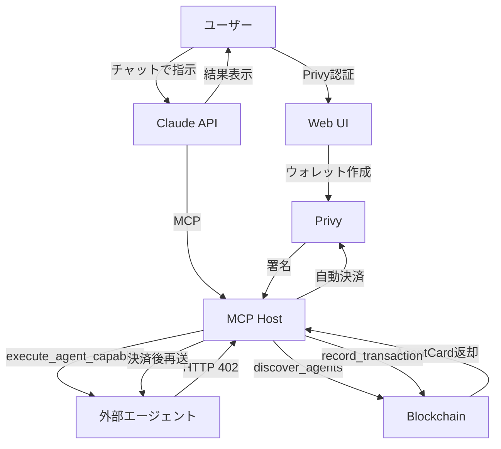
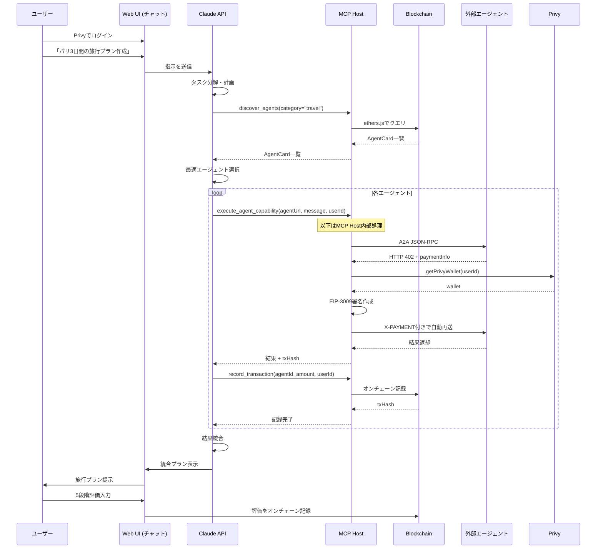

アイデアのもと:https://arxiv.org/html/2507.19550v1

## 1. プロダクト概要

### 1.1 目的

A2A、x402、ブロックチェーンを融合した AI エージェント向け分散型マーケットプレイス。エージェントが自律的に他のエージェントを発見・利用・決済できるエコシステムを実現する。

### 1.2 コアバリュー

- **Discovery（発見）**: オンチェーンでエージェントを検索・発見
- **Trust（信頼）**: ブロックチェーンベースの評価システム
- **Automation（自動化）**: x402 による人間介入不要の決済
- **Openness（開放性）**: フレームワーク非依存の標準準拠

---

## 2. システム構成

### 2.1 技術スタック

| レイヤー         | 技術                          | 役割                         |
| ---------------- | ----------------------------- | ---------------------------- |
| ブロックチェーン | Solidity, Base Sepolia        | レジストリ、評価管理         |
| エージェント実行 | Claude API + MCP (fastMCP)    | ユーザーエージェント         |
| バックエンド     | Next.js, ethers.js, Privy SDK | MCP Tools実装, Discovery API |
| フロントエンド   | Next.js, Privy                | UI、ウォレット管理           |
| 決済             | x402, USDC                    | 自動マイクロペイメント       |

### 2.2 アーキテクチャ



### 2.3 LLM と MCP Host の責務分離

**LLM（Claude API）の役割**:

- タスク分解と計画立案
- 利用するエージェントの選択
- 許容コストの判断

**MCP Host の責務**:

- Agent endpoint への実際の呼び出し
- x402 決済プロトコルの実行
- 決済後の自動再送
- Privy を介した署名生成
- オンチェーンへの記録

**重要原則**: x402 決済および決済後の再試行は MCP Host の内部処理として行われる。LLM は x402 の存在を直接認識せず、単一の MCP Tool 呼び出しのみを行う。Agent endpoint への再リクエストは MCP Host が自動的に実行する。LLM は再送の有無や回数を制御しない。

---

## 3. 主要機能

### 3.1 ユーザー認証・ウォレット管理

**概要**: Privy によるソーシャルログインとウォレット自動作成

**機能**:

- ソーシャルログイン（Google、Email）
- ウォレット自動作成（秘密鍵は Privy 管理）
- USDC 入金・approve実行
- 予算上限設定

**画面**:

- ログイン画面
- ウォレット作成・入金画面
- 予算設定画面

---

### 3.2 ユーザーエージェント（Claude + MCP）

**概要**: Claude APIがMCP Toolsを使用してエージェントとして機能

**実装方式**:

- **エージェント本体**: Claude API（推論・判断・タスク計画）
- **実行レイヤー**: MCP Host（fastMCP実装）
  - `execute_agent_capability`: エージェント機能の実行（内部でA2A呼び出し、x402決済、再送を完結）
  - `discover_agents`: ブロックチェーン検索
  - `record_transaction`: オンチェーン記録

**エージェントの動作**:

1. ユーザーから自然言語で指示を受け取る
2. Claude APIがタスクを分解・計画
3. MCP Toolsを呼び出して実行
4. 結果を統合して自然言語で返却

**MCP Tools詳細**:

```typescript
// discover_agents Tool
- 機能: ethers.jsでブロックチェーンからAgentCard検索
- 入力: category, maxPrice, minReputation
- 出力: AgentCard配列

// execute_agent_capability Tool
- 機能: エージェント機能の実行（A2A + x402 + 再送を内部で完結）
- 入力: agentUrl, message, userId
- 内部処理:
  1. A2A JSON-RPC呼び出し（fetch）
  2. HTTP 402受信時、Privyウォレット取得
  3. EIP-3009署名作成
  4. X-PAYMENTヘッダー構築
  5. 決済付きA2A再送（自動）
- 出力: エージェント応答, txHash

// record_transaction Tool
- 機能: ethers.jsでオンチェーン記録
- 入力: agentId, amount, userId
- 出力: txHash
```

**PoC制限**: ユーザー独自のエージェントエンドポイント登録は未対応

---

### 3.3 外部エージェント（サービス提供側）

**概要**: マーケットプレイスで発見されるエージェント

**要件**:

- オンチェーンにAgentCard登録
- A2Aプロトコル実装
- x402対応（HTTP 402 + 決済処理）
- ADKで実装（サンプル2-3個）

---

### 3.4 エージェント検索・発見

**概要**: 必要な機能を持つエージェントをマーケットプレイスから検索

**検索方法**:

- **ユーザー向け**: Web UIのマーケットプレイス画面（Discovery API経由）
- **Claude（エージェント）向け**: MCP Tool `discover_agents`

**検索条件**:

- キーワード
- カテゴリ
- 価格範囲
- 評価スコア

**表示項目**:

- エージェント名
- 価格
- 評価スコア（5段階評価の平均）
- 総利用回数

---

### 3.5 エージェント実行フロー



**ユーザー操作**:

1. Privyでログイン
2. ウォレットにUSDC入金（事前approve実行）
3. チャット画面で指示を入力（例: 「パリ3日間の旅行プラン作成」）
4. Claudeエージェントが自動実行（MCP Tools経由）
5. 統合結果を自然言語で表示
6. 5段階評価を入力

---

### 3.6 x402 決済

**前提条件**: 全登録エージェントは x402 対応済み

**決済フロー（MCP Host内部処理）**:

1. Claude → `execute_agent_capability` Tool呼び出し
2. MCP Host内部:
   - 外部エージェントにA2Aリクエスト
   - HTTP 402 + paymentInfo受信
   - Privyウォレット取得
   - EIP-3009署名作成
   - X-PAYMENTヘッダー構築
   - 決済付きA2A再送（自動）
   - 決済検証・実行
   - 結果受信
3. MCP Host → Claudeに結果返却
4. Claude → `record_transaction` Tool呼び出し

**決済情報**:

- 決済額（USDC）
- 決済元/先アドレス
- タイムスタンプ
- トランザクションハッシュ

---

### 3.7 レピュテーションシステム

**評価方式**: PoCでは5段階評価（1-5）の平均値

**計算方法**:

```
平均評価 = 総評価点数 ÷ 評価回数
例: (5 + 4 + 5 + 3) ÷ 4 = 4.25
```

**評価フロー**:

1. エージェント実行完了後、ユーザーがUI画面で1-5の評価を入力
2. フロントエンド → バックエンドAPI経由でオンチェーン記録
3. スマートコントラクトが自動で平均値を更新

**記録タイミング**: トランザクション完了後、ユーザーが評価入力時

**表示場所**:

- マーケットプレイス一覧
- エージェント詳細画面
- トランザクション履歴

---

## 4. 画面定義

### 4.1 画面一覧

| 画面名               | 主要機能                                                   |
| -------------------- | ---------------------------------------------------------- |
| ログイン             | Privy 認証                                                 |
| ウォレット作成・入金 | USDC 入金、approve実行、アドレス表示                       |
| 予算設定             | 日次上限、自動承認閾値設定                                 |
| チャット画面         | 指示入力、実行ログ表示（Claude + MCP）、結果表示、評価入力 |
| マーケットプレイス   | 検索、一覧、詳細表示、評価スコア表示                       |
| トランザクション履歴 | 決済一覧、評価履歴、統計グラフ                             |

---

## 5. データ定義

### 5.1 エージェント情報（オンチェーン）

```solidity
struct Skill {
    string id;
    string name;
    string description;
}

struct PaymentInfo {
    address tokenAddress;      // USDC contract address
    address receiverAddress;   // エージェントの受取アドレス
    uint256 pricePerCall;      // 1回あたりの価格（6 decimals）
    string chain;              // "base"
}

struct AgentCard {
    // === A2A標準フィールド ===
    bytes32 agentId;
    string name;
    string description;
    string url;                // A2Aエンドポイント
    string version;
    string[] defaultInputModes;
    string[] defaultOutputModes;
    Skill[] skills;

    // === ブロックチェーン拡張 ===
    address owner;
    bool isActive;
    uint256 createdAt;

    // === 評価システム（5段階評価の平均） ===
    uint256 totalRatings;      // 評価の合計（例: 5+4+5 = 14）
    uint256 ratingCount;       // 評価回数（例: 3回）
    // 平均評価 = totalRatings / ratingCount

    // === x402決済情報 ===
    PaymentInfo payment;

    // === カテゴリ ===
    string category;
}
```

### 5.2 トランザクション記録（オンチェーン）

```solidity
struct Transaction {
    bytes32 txId;
    bytes32 agentId;
    address caller;
    uint8 rating;              // ユーザー評価（1-5）
    uint256 amount;            // 支払額
    uint256 timestamp;
}
```

---

## 6. 外部連携仕様

### 6.1 A2A プロトコル準拠

**エージェント提供者の要件**:

- `.well-known/agent.json` 提供
- A2Aエンドポイント実装
- JSON-RPC 2.0 対応
- HTTPS 通信

### 6.2 x402 プロトコル準拠

**エージェント提供者の要件**:

- HTTP 402 ステータスコード返却
- x402 ヘッダー提供
- USDC（Base）決済受付
- EIP-3009対応
- Coinbase x402 SDK 使用推奨

### 6.3 Claude API

**使用モデル**: Claude Sonnet 4

**Tool Use機能**: MCP Tools呼び出しに使用

**API Key管理**: 環境変数で保護

---

## 7. 非機能要件

### 7.1 パフォーマンス

- エージェント検索: 1 秒以内
- x402 決済完了: 3 秒以内（MCP Host内部処理）
- レピュテーション更新: 3 秒以内
- Claude API応答: 5-10 秒以内（Tool呼び出し含む）
- MCP Tool実行: 2-5 秒以内/Tool（決済含む）

### 7.2 セキュリティ

- Privy による秘密鍵管理
- HTTPS 通信必須
- ウォレットアドレス検証
- Claude API Key保護（環境変数）
- MCP Tools実行時のユーザー認証

### 7.3 スケーラビリティ（PoC）

- 登録エージェント数: 10件程度
- 同時実行ユーザー: 10 人
- 1ユーザーあたりClaude API呼び出し: Tool Use形式で2-3回/タスク
- 1タスクあたりMCP Tool呼び出し: 3-5回

---

## 8. PoC スコープ

### 8.1 含む機能

- ✅ スマートコントラクト（登録・検索・評価）
- ✅ Discovery API（マーケットプレイス用）
- ✅ Privy 統合
- ✅ **MCP Host実装（fastMCP）**
  - ✅ discover_agents
  - ✅ execute_agent_capability（A2A + x402 + 再送を内包）
  - ✅ record_transaction
- ✅ Claude API統合（Tool Use）
- ✅ x402 決済フロー（MCP Host内部処理）
- ✅ サンプルエージェント 2-3 個（ADK）
- ✅ Web UI（6 画面、チャット含む）
- ✅ CLI ツール（エージェント登録用）

### 8.2 含まない機能

- ❌ Claude Desktop統合（Claude APIで実装）
- ❌ DAO ガバナンス
- ❌ 紛争解決システム
- ❌ AIレコメンデーション
- ❌ モバイルアプリ
- ❌ マルチチェーン対応
- ❌ ユーザー独自エージェントのエンドポイント登録

---

## 9. 開発ステップ

### Step 1: ブロックチェーン基盤

- スマートコントラクト実装（AgentCard, Transaction, 評価システム）
- Base Sepolia デプロイ
- テスト

### Step 2: MCP Host基盤

- Next.js セットアップ
- fastMCP導入
- MCP Tools実装
  - discover_agents（ethers.js）
  - execute_agent_capability（fetch + Privy SDK統合）
  - record_transaction（ethers.js）

### Step 3: ウォレット & 認証

- Privy 統合
- ログイン画面
- ウォレット作成・入金画面
- MCP HostからのPrivy連携実装

### Step 4: Claude API統合

- Tool Use実装
- MCP Tools呼び出しフロー
- エラーハンドリング

### Step 5: チャットUI

- チャット画面実装
- Claude API呼び出し
- 実行ログ表示（Tool呼び出し履歴）
- 評価入力機能

### Step 6: Discovery API

- オンチェーン連携（ethers.js）
- 検索機能
- キャッシュ実装

### Step 7: サンプルエージェント

- ADK で作成（Flight, Hotel, Tourism）
- x402 実装
- オンチェーン登録

### Step 8: マーケットプレイス & 履歴

- マーケットプレイス画面
- トランザクション履歴画面
- 統計グラフ

### Step 9: デモ準備

- 統合テスト
- デモシナリオ検証
- ドキュメント

---

## 10. デモシナリオ

**目標**: 「パリ 3 日間の旅行プラン」と入力し、Claudeエージェントが自動で航空券・ホテル・観光エージェントを発見・利用し、統合プランを提示

**フロー**:

1. ユーザーが Privy でログイン
2. 10 USDC 入金・approve実行
3. チャット画面で「パリ 3 日間の旅行プラン」と入力
4. Claudeエージェントが自動実行:
   - タスク分解: 「フライト・ホテル・観光が必要」
   - [MCP: discover_agents] 全AgentCard取得
   - エージェント選択: FlightAgent, HotelAgent, TourismAgent
   - [MCP: execute_agent_capability] FlightAgent実行（内部でA2A呼び出し、HTTP 402受信、Privy署名、決済、再送を完結）
   - [MCP: record_transaction] オンチェーン記録
   - （ホテル・観光も同様に実行）
   - 結果統合
5. 統合プラン表示（自然言語）
6. ユーザーが5段階評価入力
7. 全取引・評価がオンチェーン記録

**実行ログ表示例**:

```
[Claude] タスクを分析中...
[MCP: discover_agents] カテゴリ「travel」で検索中...
[MCP: discover_agents] 3件のエージェントを発見
[Claude] FlightAgent（評価4.5）を選択
[MCP: execute_agent_capability] FlightAgentを実行中...
[MCP: execute_agent_capability] 決済完了（tx: 0x1234...）
[MCP: record_transaction] オンチェーン記録完了
[Claude] フライト情報を取得しました
...
[Claude] 旅行プランを作成しました!
```

---

## 11. ER図


**テーブル説明**:

- `users`: Privyユーザー情報
- `budget_settings`: 予算上限設定
- `transactions`: オフチェーントランザクション参照（tx_hashでオンチェーンを参照）
- `agent_ratings`: 評価記録（オンチェーンのTransactionを参照）
- `agent_cache`: AgentCardのキャッシュ（Discovery API用、パフォーマンス向上）
- `mcp_sessions`: MCP実行セッション履歴（デバッグ・監査用）

**注**: 評価・トランザクションの実体はオンチェーン。オフチェーンDBは参照・キャッシュのみ。

---

## 12. MCP Tools仕様詳細

### 12.1 discover_agents

```typescript
{
  name: "discover_agents",
  description: "ブロックチェーンからAgentCardを検索",
  inputSchema: {
    type: "object",
    properties: {
      category: { type: "string", description: "カテゴリ" },
      maxPrice: { type: "number", description: "最大価格" },
      minReputation: { type: "number", description: "最小評価" }
    }
  },
  handler: async ({ category, maxPrice, minReputation }) => {
    const registry = new ethers.Contract(REGISTRY_ADDRESS, ABI, provider);
    const agents = await registry.getAgentsByCategory(category);
    // フィルタリング・整形
    return { agents: filteredAgents };
  }
}
```

### 12.2 execute_agent_capability

```typescript
{
  name: "execute_agent_capability",
  description: "エージェント機能の実行（A2A + x402決済 + 再送を内部で完結）",
  inputSchema: {
    type: "object",
    properties: {
      agentUrl: { type: "string" },
      message: { type: "string" },
      userId: { type: "string" }
    },
    required: ["agentUrl", "message", "userId"]
  },
  handler: async ({ agentUrl, message, userId }) => {
    // 1. 初回A2Aリクエスト
    const initialResponse = await fetch(agentUrl, {
      method: "POST",
      headers: { "Content-Type": "application/json" },
      body: JSON.stringify({
        jsonrpc: "2.0",
        method: "message/send",
        params: { message }
      })
    });

    // 2. HTTP 402の場合、自動決済処理
    if (initialResponse.status === 402) {
      const paymentInfo = await initialResponse.json();

      // Privyウォレット取得
      const wallet = await getPrivyWallet(userId);

      // EIP-3009署名作成
      const domain = { /* ... */ };
      const types = { /* TransferWithAuthorization */ };
      const value = {
        from: wallet.address,
        to: paymentInfo.receiver,
        value: paymentInfo.amount,
        validAfter: 0,
        validBefore: Math.floor(Date.now() / 1000) + 3600,
        nonce: ethers.hexlify(ethers.randomBytes(32))
      };

      const signature = await wallet.signTypedData(domain, types, value);

      // X-PAYMENTヘッダー構築
      const payment = {
        from: wallet.address,
        to: paymentInfo.receiver,
        value: paymentInfo.amount,
        signature,
        // ... その他のフィールド
      };
      const paymentBase64 = Buffer.from(JSON.stringify(payment)).toString('base64');

      // 3. 決済付きで自動再送
      const retryResponse = await fetch(agentUrl, {
        method: "POST",
        headers: {
          "Content-Type": "application/json",
          "X-PAYMENT": paymentBase64
        },
        body: JSON.stringify({
          jsonrpc: "2.0",
          method: "message/send",
          params: { message }
        })
      });

      const paymentResponse = retryResponse.headers.get("X-PAYMENT-RESPONSE");
      const txHash = JSON.parse(Buffer.from(paymentResponse, 'base64').toString()).txHash;

      return {
        status: "success",
        result: await retryResponse.json(),
        txHash
      };
    }

    // 決済不要の場合はそのまま返却
    return {
      status: "success",
      result: await initialResponse.json()
    };
  }
}
```

### 12.3 record_transaction

```typescript
{
  name: "record_transaction",
  description: "トランザクションをオンチェーン記録",
  inputSchema: {
    type: "object",
    properties: {
      agentId: { type: "string" },
      amount: { type: "number" },
      userId: { type: "string" }
    },
    required: ["agentId", "amount", "userId"]
  },
  handler: async ({ agentId, amount, userId }) => {
    const wallet = await getPrivyWallet(userId);
    const registry = new ethers.Contract(REGISTRY_ADDRESS, ABI, wallet);

    // rating=0（評価は後でユーザーが入力）
    const tx = await registry.recordTransaction(agentId, 0, amount);
    await tx.wait();

    return {
      status: "success",
      txHash: tx.hash
    };
  }
}
```
